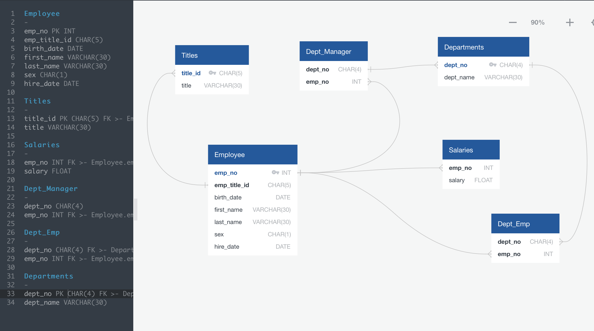
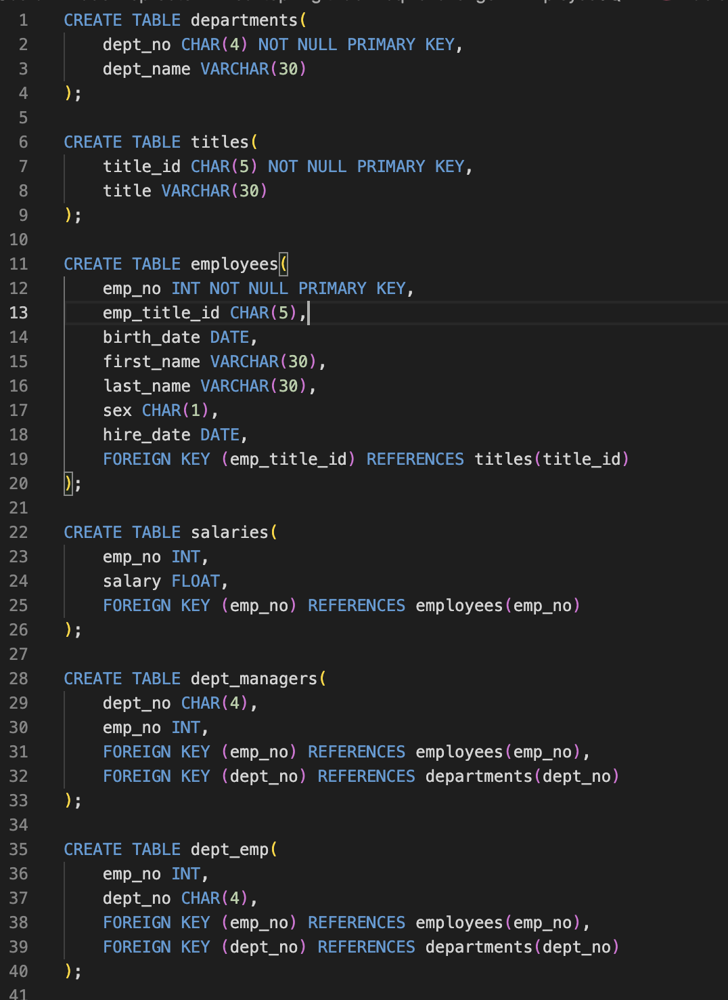
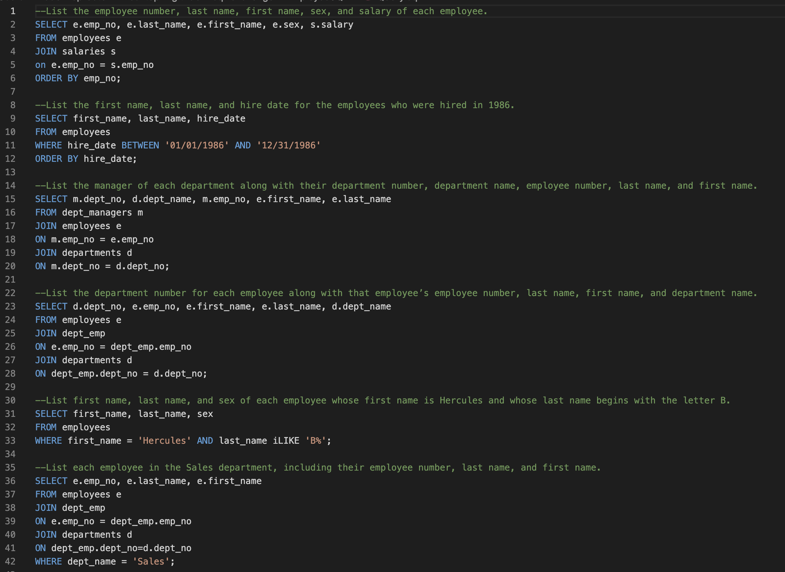
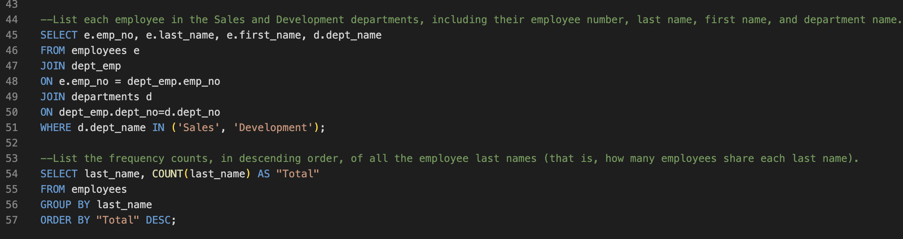

# sql-challenge

## Overview of Project

### Data Modeling 
   * Entity Relationship Diagram is included or table schemas provided for all tables

### Data Engineeing
   * All required columns are defined for each table 
   * Columns are set to the correct data type 
   * Primary Keys set for each table 
   * Correctly references related tables 
   * Tables are correctly related using Foreign Keys 
   * Correctly uses NOT NULL condition on necessary columns 
   * Accurately defines value length for columns 

### Data Analysis
   * List the employee number, last name, first name, sex, and salary of each employee 
   * List the first name, last name, and hire date for the employees who were hired in 1986 
   * List the manager of each department along with their department number, department name, employee number, last name, and first name 
   * List the department number for each employee along with that employee’s employee number, last name, first name, and department name
   * List first name, last name, and sex of each employee whose first name is Hercules and whose last name begins with the letter B
   * List each employee in the Sales department, including their employee number, last name, and first name
   * List each employee in the Sales and Development departments, including their employee number, last name, first name, and department name
   * List the frequency counts, in descending order, of all the employee last names (that is, how many employees share each last name)

### Purpose

* I am utilizing PG Admin to analyze data from CSV in order to get more detailed information about what the pulled data shows.

## Analysis and Challenges

### Analysis of Outcomes Based on Goals

* During this assignment I was able to complete all the goals and objectives for the assignment. I used what I have learned in the class to trouble shooting the code as I went with PG Admin and made sure I was fully understanding what each part of my code did through labeling, so when an error popped up I knew how to approach the problem.

### Challenges and Difficulties Encountered

* I think the biggest challenge for me was figured out how to import the data from the csv's into the tables I created in SQL. I hit a lot of errors and road blocks, but breaks and repetition won over and eventually I figured out what I needed to do.

#### Data Modeling

#### Data Engineering

#### Data Analysis

## Results

* What are two conclusions you can draw about the data?
    * Many People in the company have very similar names.
    * The management in each department looks like the departments each have two managers.
